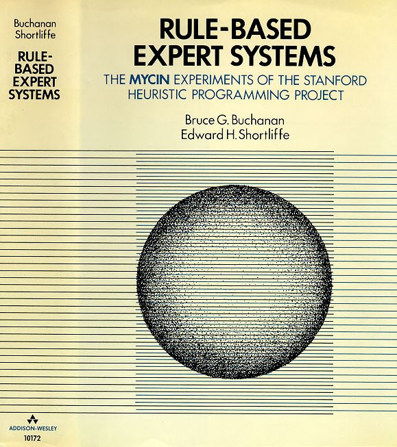

1. **Вступ**  
  В цьому документі описуються запити зацікавлених осіб, які виступають користувачами системи експертної оцінки ExpSys
    1. **Мета**  
      Метою документу є визначення основних вимог до функціональності, продуктивності та експлуатаційної придатності, а також визначення бізнес-правил та технологічних обмежень, виставлених до предмету розробки.
    2. **Контекст**  
      Список вимог, перелічених у цьому документі, є основою технічного завдання на розробку системи експертної оцінки ExpSys.
2. **Основні положення**  
  Експертні системи - це клас комп’ютерних програм, які пропонують рекомендації, проводять аналіз, виконують класифікацію, дають консультації і ставлять діагноз. Вони орієнтовані на розв’язування задач, вирішення яких вимагає проведення експертизи людиною-спеціалістом.   

      Експертні системи працюють з проблемами у вузькій предметній області (конкретній ділянці експертизи) на основі логічних міркувань. Такі системи часто можуть знайти розв’язок для неструктурованих та неточно визначених задач. Основним призначенням ЕС є розробка програмних засобів, які при рішенні задач, важких для людини, одержують результати, що не уступають по якості й ефективності розвязків, розвязків одержаним людиною-експертом.  

      ЕС використовуються для рішення задач, загальним для яких є те, що: задачі не можуть бути задані в числовій формі; висновки не можна виразити в термінах точно визначеної цільової функції; не існує алгоритмічного розвязку задачі; якщо алгоритмічний розвязок є, то його не можна використовувати через обмеженості ресурсів (час, пам'ять).
    Крім того, неформалізовані задачі характеризуються помилковістю, неповнотою, неоднозначністю і суперечливістю як вихідних даних, так і знань про розв'язувану задачу.

      Є різні типи експертних систем. Вони мають різні принципи роботи. Більшість експертних систем засновані на одному з наступних методів: [дерева рішень](https://uk.wikipedia.org/wiki/%D0%94%D0%B5%D1%80%D0%B5%D0%B2%D0%BE_%D1%83%D1%85%D0%B2%D0%B0%D0%BB%D0%B5%D0%BD%D0%BD%D1%8F_%D1%80%D1%96%D1%88%D0%B5%D0%BD%D1%8C), [прямий ланцюжок міркувань](https://uk.wikipedia.org/wiki/%D0%9F%D1%80%D0%BE%D0%B4%D1%83%D0%BA%D1%86%D1%96%D0%B9%D0%BD%D1%96_%D0%BF%D1%80%D0%B0%D0%B2%D0%B8%D0%BB%D0%B0), [обернений ланцюжок міркувань](http://thales2002.narod.ru/zher7.html), [побудова експертних оцінок](http://lib.chdu.edu.ua/pdf/posibnuku/313/11.pdf), [обробка експертних оцінок](http://matveev.kiev.ua/exprt/t4.pdf). Також зараз використовуються нові типи експертних систем: [Байєсівські експертні системи](http://lib.chdu.edu.ua/pdf/naukpraci/computer/2012/191-179-12.pdf), [нечіткі експертні системи](https://uk.wikipedia.org/wiki/%D0%9D%D0%B5%D1%87%D1%96%D1%82%D0%BA%D0%B0_%D0%BB%D0%BE%D0%B3%D1%96%D0%BA%D0%B0), [м’які експертні системи](https://sites.google.com/site/ne4itkalogika/nejro-necitki-merezi), експертні системи на основі теорії [Демстера-Шеффера](http://www.habarov.spb.ru/new_es/exp_sys/es09/es9.htm).
    Математичні апарати різні у перелічених типах експертних систем. Але більшість із них засновані на алгоритмах для побудови дерев рішень таких, як ID3, C4.5(покращена версія ID3, J48 — реалізація на Java, входить в пакет Weka; C5.0 (Linux) / See5 (Windows) — реалізація на C), CART(модифікації: IndCART, DB-CART), Автоматичний детектор взаємодії Хі-квадрат (CHAID), MARS.

    **Існуючі експертні системи**    
    В результаті проведених досліджень було виявлено декілька відомих існуючих експертних систем, що набули популярності за рахунок своїх специфічних функцій і особливостей. До них належать:
     1.	CLIPS
     2.	WolframAlpha
     3.	Mycin   

      Порівняння основних характеристик даних систем, що відносятся до бізнес-процесу представлено у нступній таблиці.

      | Система       | СLIPS         | WolframAlpha  | Mycin     |    
      | ------------- | :-----------: | :-----------: | :-------: |
      | Інтегрована база знань | Так | Так | Так |  
      | Створення власної експертної системи | Так | Ні | |  
      | Формування користувачем бази знань | Так | Ні | Так |
      | Використання результатів досліджень іншими системами | Так | Так | Так |  
      | Доступність системи (система безкоштовна у комерції) | Так | Ні | (комерція відсутня) |  
      | Підтримка системи розробником у реальному часі | Так | Так | Ні |  
      | Участь користувача у розробці системи | Так | Так | Ні |  
      | Відсутність необхідності у спеціальних навичках користувача-організатора дослідження у непрофільній для дослідження галузі | Ні | Так | Так |  
      | Тип системи | Конструктор експертних систем | База знань з експертною системою формування, налагодження і розробки цієї бази | Класична експертна система |  
   
   Далі детальніше про кожну з них.  
      ### CLIPS   
        

      **Історія**: Перші версії CLIPS розроблялися з 1984 року в Космічному центрі Джонсона (Johnson Space Center), NASA (як альтернатива існуючій тоді системі ART*Inference), поки на початку 1990-х не було призупинено фінансування.

      **Основні функції**: надання інструментів і засобів для створення власних експертних систем, використовуючи базу знань, засновану на принципі «представлення знань у вигляді знань». Також до функцій системи можна віднести можливість організації власної бази знань, основними структурними елементами якої є факти, правила (для роботи із фактами), змінні (непостійні факти) та машина логічного виводу (яка за допомогою правил та на основі фактів та змінних утворює нові факти та змінні).  

      **Особливості**: дану систему радше слід віднести до зовнішніх систем, аніж до експертних, так як дана система реалізує інструментарій і підтримку для створення власних експертних систем. Через це CLIPS вважається зовнішньою СИСТЕМОЮ, тобто фактично вона є не самою експертною системою, а її, так би мовити «батьківським класом», чи, іншими словами, породжувачем неоднакових експертних систем. Крім того, CLIPS включає в себе повноцінну об'єктно-орієнтовану мову COOL для написання експертних систем.
    ### WolframAlpha
    

    **Історія**: засновник проекту - Стівен Вольфрам. Проект було запущено 15 травня 2009 року. Є однією з найпопулярніших експертних систем у сфері підтримки і допомоги прийняття рішень у інженерних питаннях та специфічних математичних, фізичних, хімічних та інших складних розрахунках і задачах. У даний момент система поширюється на платній основі (ціна за використання варіюється в залежності від терміну і особливостей її застосування) і має лише англійську локалізацію.

    **Основні функції**: обчислює відповідь на запит, ґрунтуючись на власній базі знань, яка містить дані з математики, фізики, астрономії, хімії, біології, медицини, історії, географії, політики, музики, кінематографії, а також інформацію про відомих людей та інтернет-сайти. До того ж дана система здатна переводити дані між різними одиницями вимірювання, системами числення, підбирати загальну формулу послідовності, знаходити можливі замкнуті форми для наближених дробових чисел, обчислювати суми, границі, інтеграли, розв'язувати рівняння і системи рівнянь, проводити операції з матрицями, визначати властивості чисел і геометричних фігур. Експертні функції в основному стосуються розробки, підтримки і налагодження системи у реальному часі для збереження рівня актуальності.

    **Особливості**: структура даної експертної системи уявляє собою поєднання баз знань з обчислювальними алгоритмами, коректність, актуальність, а також додавання нових алгоритмів підтримують експерти. Окремо хотілося б виділити неявно приналежність даної системи до експертних, так як її «експертність» полягає у постійній розробці, підтримці і розширенні системи. Механізм для даних операцій і є власне експертною системою (за ознаками і визначенням).   
    ### Mycin
    

    **Історія**: MyCin була ранньою експертною системою, розробленою за 5 чи 6 років на початку 1970х років в Стенфордському університеті. Вона була написана на мові програмування LISP як докторська дисертація Едварда Шортлайфа (англ. Edward Shortliffe) під керівництвом Брюса Бучанана (англ. Bruce Buchanan), Стенлі Н. Коена (англ. Stanley N. Cohen) та інших. За розрахунком Шортлайфа ризначенням цієї програми було виконувати обов'язки асистента лікаря, який не є вузьким спеціалістом в області застосування антибіотиків. Після 1976 року система неодноразово модифікувалася і оновлювалася, але базова версія на момент активної розробки складалася з п'яти компонентів.
    *	База знань містить фактичні знання, що стосуються предметної області, і відомості про наявні невизначеностях.
    *	Загальні бази даних пацієнтів містять інформацію про конкретних пацієнтів та їх захворювання.
    *	Консультуюча програма задає питання, виводить укладення системи і дає поради для конкретного випадку, використовуючи інформацію про пацієнта і статичні знання.
    *	Пояснююча програма відповідає на питання і дає користувачеві інформацію про те, на чому ґрунтуються рекомендації або висновки, сформульовані системою. При цьому програма приводить трасування процесу вироблення рекомендацій.
    *	Програма сприйняття знань служить для оновлення знань, що зберігаються в системі, в процесі її експлуатації.

      **Основні функції**: надання  консультаційної допомоги лікарям невузького профілю для розв’язання діагностичних задач, що вимагають вузькопрофільної медичної спеціалізації та досвіду, шляхом алгоритмічного підбору системою найбіль вірогідних варіантів і їх оцінки експертною групою та лікарем – запитувачем. Також однією з функцій є можливість прямої участі спеціалістів (не з кола модераторів чи експертів) у розробці бази знань у реальному часі за слідування певних правил.  

      **Особливості**: в процесі роботи програма формує гіпотези діагнозу і надає їм певні ваги, але самостійно, як правило, не робить остаточного вибору. Для цього в ході консультації виконується проста двоетапна процедура:
      *	Формується контекст пацієнта у формі самого верхнього вузла контекстного дерева;
      *	Робиться спроба застосувати цільове правило до цього контексту пацієнта.  
      Консультація являє собою пошук на деревоподібному графі цілей. У корені дерева розташовується мета самого верхнього рівня - та частина цільового правила, в якій відображено дію - рекомендований курс лікарської терапії. На нижчих рівнях розміщуються підцілі, які являють собою, наприклад, з'ясування, які мікроорганізми виявлені в заражених тканинах і наскільки істотним є зараження кожного з них. Отже, якщо характеризувати MyCin у наступних (ще не досягнутих) версіях розробки (тобто, із частковою, а не цілковитою автоматизацією), дана система уявляє собою приклад класичної експертної системи як за визначенням, так і за ієрархією її модулів.  
3. **Короткий огляд продукту**  
Система експертної оцінки ExpSys представляє собою веб-сайт, де можна отримати точну та кваліфіковану оцінку з певного питання, а також отримати роботу і стати одним із кваліфікованих  експертів нашої системи.
4.	**Ділові правила**  
    1. **Призначення експертної системи**  
Функціональність даної системи направлена на надання експертної оцінки з певного кола питань.
    2. **Політика взаємодії з клієнтом**  
Клієнтами веб-сервісу є фізичні або юридичні особи, які представляють свої інтереси та(або) інтереси однієї або декількох організацій.
Політика взаємовідносин з клієнтами сервісу полягає  у наданні їм експертної оцінки в якомусь питанні.
    3. **Організація обслуговування клієнтів**
Після заповнення заявки на експертну оцінку питання на веб-сайті клієнт отримує результат після закінчення часу оцінювання.
    4.	**Характеристики ділового процесу**  
        Клієнти: роблять замовлення на експертну оцінку, отримують результати роботи  
        Експерти: отримують запрошення на оцінку, дають оцінку певній проблемі, після закінчення часу оцінки можут подивитися результати, при груповому оцінюванні можуть дивитися результати у будь-який час.  
        Модератори: завіряють реєстрацію користувачів, створюють оцінювання та узгоджують деталі з клієнтами, надають кінцеві результати клієнтам.  
        Система: управляє реєстрацією нових користувачів, надає інструменти для створення опитування, керує пересиланнями всіх типів повідомлень, таких як: заявка на створення опитування, передача опитування клієнту на узгодження, участь експертів у оцінюванні, аналіз даних оцінювання і формування статистичного результату, фіксування всіх проміжних та кінцевих даних, передача статистичних даних оцінювання модератору  і відповіді модератора клієнту.
    5.	**Користувацькі сценарії**  
        1.	**Сценарій реєстрації експерта**  
            Назва:expert_registration;  
            ID:001;  
            Учасники: експерт, модератор, система;  
            Передумови: користувач хоче зареєструватися як експерт;  
            Результат: користувач зареєстрований як експерт;  
            Основний сценарій:
            1.	Користувач заповнює загальну частину заявки.
            2.	Користувач вказує галузі, в яких він буде працювати експертом і проходить тест по цим галузям.
            3.  Система передає заявку на розгляд модератору.
            4.	Модератор розглядає заявку і реєструє користувача як експерта.  
            Виключні випадки:  
            1.	Може виникнути через недостатню кваліфікацію експерта. Тоді модератор може відхилити заяву, але профіль експерта зберігається у системі.
            2.	Може виникнути відхилення заявки через наявність уже створеного аканта у даного користувача. В такому випадку система надсилає клієну повідомлення про неможливіть створення нового проофілю.
        2.	**Сценарій реєстрації клієнта**  
            Назва:client_registration;  
            ID:002;  
            Учасники:клієнт, модератор, система;  
            Передумови: користувач хоче зареєструватися як клієнт;  
            Результат: користувач зареєстрований як клієнт;  
            Основний сценарій:
            1.	Користувач заповнює загальну частину заявки і вказує, що реєструється як клієнт.
            2.  Система передає заявку на розгляд модератору.
            3.	Модератор розглядає заявку і реєструє користувача як клієнта.  
            Виключні випадки:  
            1.	Може виникнути відхилення заявки через наявність уже створеного аканта у даного користувача. В такому випадку система надсилає клієну повідомлення про неможливіть створення нового профілю.
        3.	**Сценарій подання заявки на оцінку експертами**  
            Назва:evaluation_request;  
            ID:003;  
            Учасники: клієнт, модератор, система;  
            Передумови: клієнт хоче отримати оцінку предмету галузі;  
            Результат: клієнт отримав оцінку предмету галузі;  
            Основний сценарій:
            1.	Клієнт вказує галузі, в межах яких буде розглядатися питання, вказує час  оцінки, може вибрати експертів, які будуть робити оцінку, та тип оцінювання: індивідуальне або групове, а також саме питання для оцінки.
			2.  Система перевіряє правильність заповнення заяви і передає заявку модератору.
            3.	Модератор отримує заявку, формалізує питання і створює за допомогоє засобів системи опитування експертів для оцінки.
            4.	Питання надсилається на оцінку експертам галузі.  
            Виключні випадки:  
            1.	Може виникнути через неправильне формальне подання заявки. Тоді система відхиляє заявку.
            2.	Може виникнути через неточність сформованого питання. Тоді модератор відсилає клієнту запит на уточнення питання для оцінки.
        4.	**Сценарій надання експертами оцінки протягом певного часу**  
            Назва:issue_evaluation;  
            ID:004;  
            Учасники: експерти, система;  
            Передумови: експерти отримали запрошення на оцінювання;  
            Результат:отриманий результат оцінювання експертів;  
            Основний сценарій:
			1.  Система надсилає експертам запрошення до оцінки.
            2.  Якщо оцінювання групове, то експерти можуть бачити оцінки інших експертів.
            3.	Експерти надають своє рішення відповідно до форми, затвердженої модератором.
            4.	Експерт може змінити свою оцінку протягом часу, даного на оцінку.
			5.  Система зберігає результати оцінювання.  
            Виключні випадки:  
            1.	Може виникнути, якщо ні один експерт не дав свою оцінку. Тоді модератору і клієнту приходять відповідні повідомлення.
        5.	**Сценарій обробки результатів модератором**  
            Назва:results_processing;  
            ID:005;  
            Учасники: експерти, модератори, клієнти, система;  
            Передумови: експерти дали оцінки даному питанню;  
            Результат:клієнт отримав оцінку щодо свого питання;  
            Основний сценарій:
            1.	Система аналізує дані і надсилається статистика модератору.
            2.	Модератор формує відповідь.
			3.  Система надсилає клієнту результати оцінювання.
            4.	Система надсилає Результати оцінювання експертам.
            5.	Система виставляє експертам рейтинг відповідно до точності їх оцінки.  
            Виключні випадки:  
            1.	Може виникнути через неоднозначність оцінок, тоді модератор надсилає клієнту отримані найбільш вірогідні результати або уточнює питання і перезапускає опитування.
5.	**Функціональність**  
Основні вимоги до функціональності, виставлені зацікавленими особами до предмету розробки, розділяються на три категорії
    1.	**Робоче місце експерта**  
Робоче місце експерта представляє собою набір форм та пунктів меню, що забезпечують виконання наступних функцій:
        1.	Отримання питання з їхньої галузі.
        2.	Оцінка цього питання протягом певного часу.
    2.	**Робоче місце клієнта**  
Робоче місце клієнта представляє собою набір форм та пунктів меню, що забезпечують виконання наступних функцій:
        1.	Надсилання питання для оцінки експертами.
        2.	Отримання результатів оцінки.
    3.	**Робоче місце модератора**  
Робоче місце модератора представляє собою набір форм та пунктів меню, що забезпечують виконання наступних функцій:
        1.	Розгляд заявок про реєстрацію експертів та клієнтів.
        2.	Розгляд заявок питань для оцінки та формування форми для експертів.
        3.	Аналіз даних після оцінки.
        4.	Надсилання результату оцінки клієнту.
        5.	Надання рейтингу експертам.
6.	**Практичність**
    1.	**Локалізація**  
Веб-сервіс мусить мати українську та англійську локалізацію
    2.	**Інтерфейс експерта**  
Зовнішній вигляд і функціональність інтерфейсу робочого місця експерта мають відповідати вимогам, що викладені в цьому документі.
    3.	**Інтерфейс клієнта**  
Зовнішній вигляд і функціональність інтерфейсу робочого місця клієнта мають відповідати вимогам, що викладені в цьому документі.
    4.	**Інтерфейс модератора**  
Зовнішній вигляд і функціональність інтерфейсу робочого місця модератора мають відповідати вимогам, що викладені в цьому документі.
7.	**Надійність**
    1.	**Резервне копіювання і відновлення даних**  
Резервне копіювання баз даних має відбуватись регулярно(кожні 24 години).
8.	**Технологічні правила та обмеження**
    1.	**Операційне оточення та базове програмне забезпечення**  
ASP.NET MVC, MS SQL Server, Entity Framework
    2.	**Конфігурація програмного забезпечення**  
Конфігурація ПЗ на боці замовника здійснюється розробником на етапі налагодження тільки в тій частині, яка безпосередньо стосується до предмету розробки.
9.	**Вимоги до документації**  
Вся документація проекту розроблюється спільно зацікавленими особами та розробником. В документацію проекту, яка передається зацікавленим особам, входять:
    1.	**Система експертної оцінки ExpSys. Запити зацікавлених осіб**  
Розроблювана система має реалізовувати зручний інтерфейс для усіх осіб, які працюють в ній, а саме: клієнтів, експертів та модераторів. Система ExpSys повинна забезпечувати високу швидкодію та надійність. Даний предмет розробки має бути гнучким для його подальшого повного або часткового застосування у інших системах експертної оцінки.
    2.	**Інтерфейс робочого місця експерта**  
Зовнішній вигляд інтерфейсу робочого стола експерта має складатися з: списку повідомлень про наявні замовлення оцінки з галузі роботи експерта, та результати уже проведених оцінок; у разі прийняття участі має з’явитися форма для надання оцінки з прийнятого замовлення.
    3.	**Інтерфейс робочого місця клієнта**  
Зовнішній вигляд інтерфейсу робочого стола клієнта має складатися з: форми створення нового замовлення на оцінювання, де має бути можливість вибрати уже існуючі галузі та запит на створення нової за відсутності альтернатив, а також інструментів для зручного створення форми для проведення оцінювання, вибір певних експертів для участі та тривалості проведення оцінювання; повідомлень про результати оцінювання.
    4.	**Інтерфейс робочого місця модератора**  
Зовнішній вигляд інтерфейсу робочого стола модератора має складатися з: повідомлень про заявки реєстрації експертів з можливістю дозволу реєстрації або відмови при занадто низькому рівні експерта; повідомлень про заявки на оцінювання і можливість прийняти або відхилити їх з розглядом заявок на додання нових галузей експертів; результати оцінювання усіх замовлень в підконтрольних йому галузях.
10.	**Тривалість проекту**  
Тривалість розробки проекту без урахування строку кінцевої відладки програмного забезпечення складає 3 місяця. При зміні вимог до предмету розробки, які спричиняють зміну складності роботи, тривалість проекту може переглядатися за домовленістю зацікавлених осіб та розробників
11.
