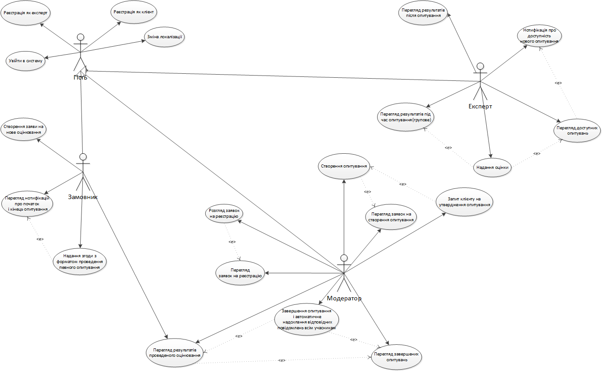
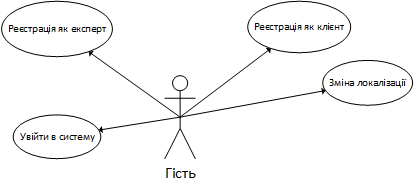
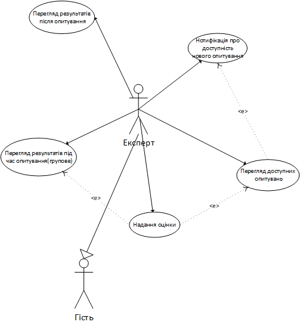
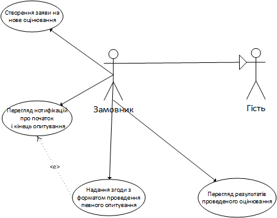
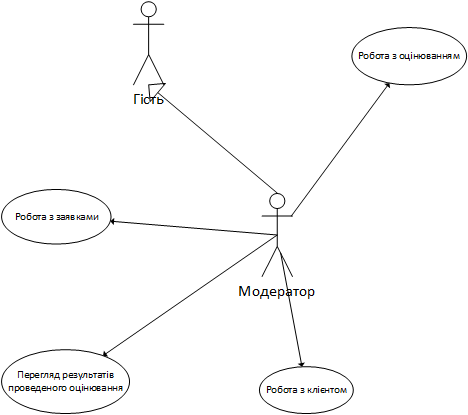
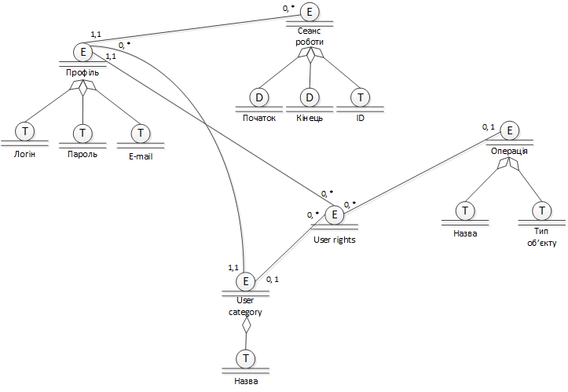
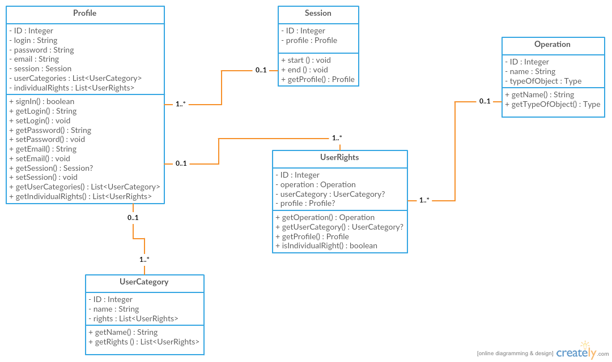

1. **Вступ**  
  В цьому документі описуються огляди прецендентів системи експертної оцінки ExpSys
    1. **Мета**  
      Метою документу є визначення основних вимог до функціональності, продуктивності та експлуатаційної придатності, а також визначення бізнес-правил та технологічних обмежень, виставлених до предмету розробки.
    2. **Контекст**  
      Список вимог, перелічених у цьому документі, є основою технічного завдання на розробку системи експертної оцінки ExpSys.
2. **Діаграма прецендентів**  
    1. **Повна діаграма**
    
    2. **Гість**
    
    3. **Експерт**
    
    4. **Замовник**
    
    5. **Модератор**
    
3. **Діаграма бізнес-об'єктів**  

4. **Діаграма класів**

